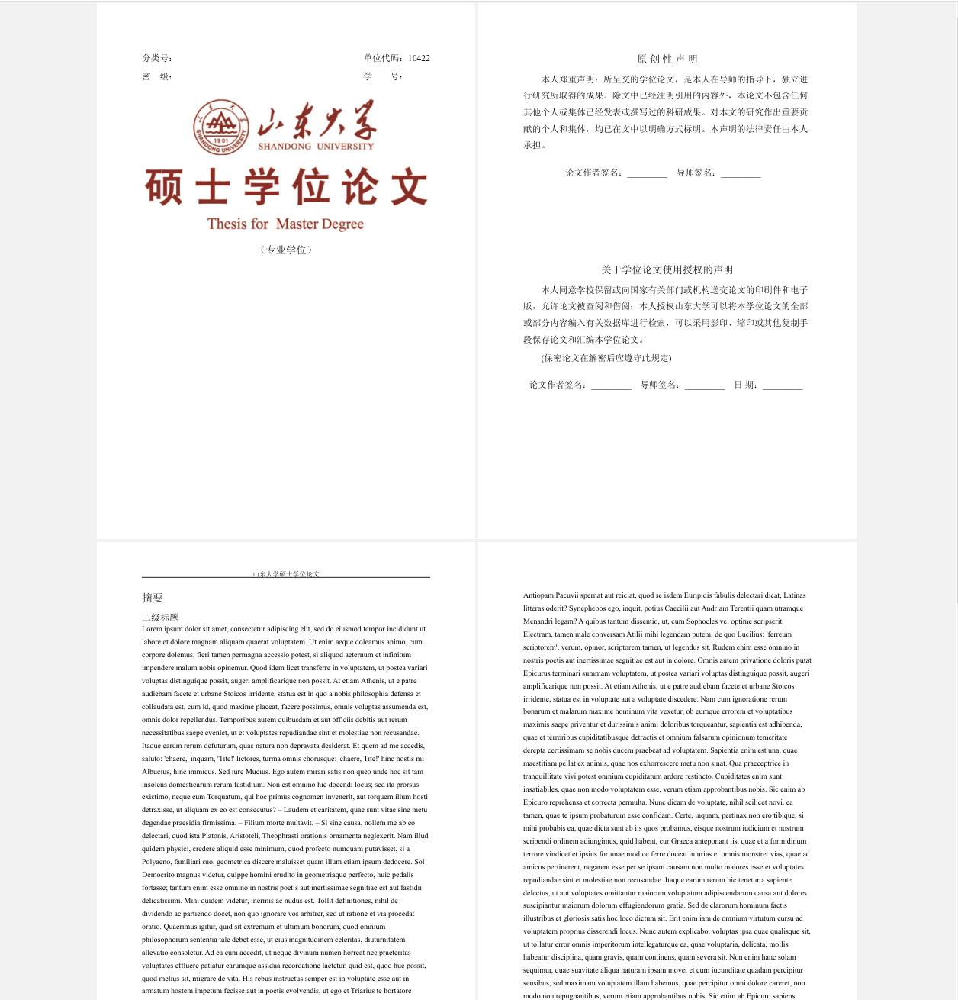

#  山东大学硕士学位论文Typst模板

> 灵感来源：
>
> 1. https://github.com/lucifer1004/pkuthss-typst
> 1. https://github.com/cherichy/BUAA-typst

2024/01/27: 最近不打算继续完成了，先放一放。

Typst工具的部署过程不在这里说了，说一下本项目的部署命令：

```bash
typst watch --font-path fonts main.typ
```


